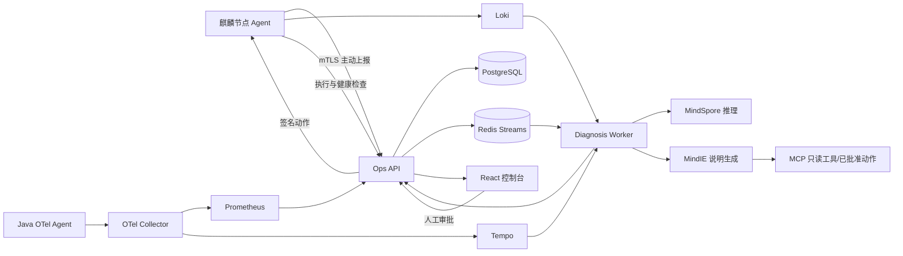

# 系统架构

## 运行闭环

## 安全边界

- Agent 不监听远程控制端口，只主动拉取动作。
- 动作必须依次通过白名单参数校验、人工审批、HMAC 签名、目标验签、过期检查、幂等检查、前置检查和健康检查。
- 执行器使用固定 argv 和 `shell=False`；sudoers 只授权包装器与两个固定 systemd 动作。
- MindIE 只把结构化证据转成说明。输出中的 Evidence ID 和动作名均由后端再次校验。
- MindIE 或 MindSpore 不可用时，规则与拓扑诊断仍可返回结果。

## 数据模型

SQLAlchemy 定义了节点、服务、依赖边、事件、证据、诊断、动作申请、执行记录、评测批次、试验结果和审计日志十一张表。OpenAPI 文件由应用代码生成，禁止前后端各自维护一套契约。

## 当前实现边界

本仓库本地默认使用单进程开发存储；设置 `DATABASE_URL` 后会加载并同步 PostgreSQL 核心实体，设置 `REDIS_URL` 后批准动作进入 Redis Stream。该实现满足 MVP 单中心持久化与重启恢复，不包含生产级迁移编排、高可用、并发冲突控制或跨地域复制。
