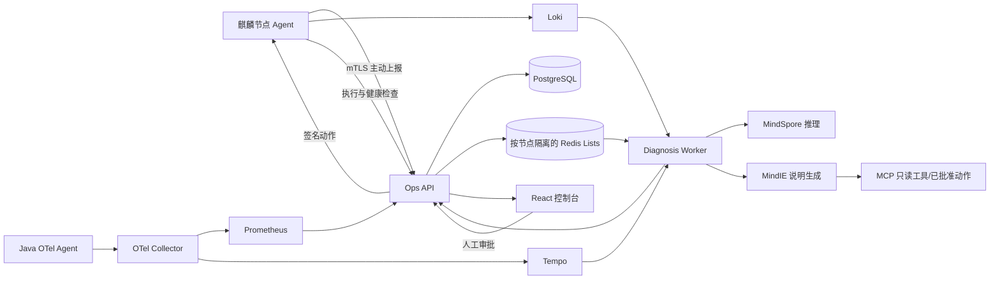

# 系统架构

## 运行闭环

## 安全边界

- Agent 不监听远程控制端口，只主动拉取动作。
- 动作必须依次通过白名单参数校验、人工审批、HMAC 签名、目标验签、过期检查、幂等检查、前置检查和健康检查。
- 执行器使用固定 argv 和 `shell=False`；sudoers 只授权包装器与两个固定 systemd 动作。
- MindIE 只把结构化证据转成说明。输出中的 Evidence ID 和动作名均由后端再次校验。
- MindIE 或 MindSpore 不可用时，规则与拓扑诊断仍可返回结果。

## 数据模型

SQLAlchemy 定义了节点、服务、依赖边、事件、证据、诊断、动作申请、执行记录、评测批次、试验结果、审计日志、用户、认证会话、Agent 凭据和遥测快照。OpenAPI 文件由应用代码生成，前端实体与请求类型从该文件生成，禁止前后端各自维护一套契约。

## 当前实现边界

未设置 `DATABASE_URL` 时，`InMemoryStore` 仅用于单元测试和演示。设置 `DATABASE_URL` 后，PostgreSQL 是唯一业务状态源，所有查询和增量写入直接针对数据库行，不加载或全量回写进程内快照。遥测表按节点保存最新快照，只更新观测字段，不覆盖名称、描述、标签等人工配置。

设置 `REDIS_URL` 后，每个节点使用独立的 Redis List，Agent 通过原子 `LPOP` 只取走自身动作，避免扫描其他节点队列。React 控制台通过 React Query 每 15 秒轮询概览和事件；管理列表按需请求并使用数据库分页。本实现保留单中心、至多一次动作交付语义，不包含跨地域复制或 Agent 崩溃后的动作重投协议。
